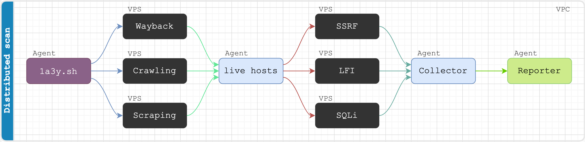

```
  _       ___
 / | __ _/_  |__ __   
|/ |/ _  | / | | | | 
 | | (_| | \ | | | |
_|__\__ _\___|\__  /
              |___/
```

<p align="center">
<a href="https://twitter.com/storenth"></a>
<a href="https://www.blackhat.com/us-21/arsenal/schedule/#lazyrecon-v-24051"></a>
<a href="https://discord.gg/fR2QVrWBTq"></a>
<a href="https://bscscan.com/address/0xb9a36d01577d82909cA01e20dB58293A6baa5dDD"></a>
</p>

`1a3y` is a subdomain discovery tool that finds and resolves valid subdomains then performs SSRF/LFI/SQLi fuzzing, brute-force and port scanning in distributed fashion. This is collab project between [`lazyrecon`](https://github.com/storenth/lazyrecon) and [`axiom`](https://github.com/pry0cc/axiom) designed for commercial use.

# Features
- Super fast asynchronous execution
- Distributed scanning
- CI/CD ready
- HTML/pdf reports
- Discord integration
- Background listen server
- Domain name, list of domains, IP, CIDR input - notations support
- Teardown and program exit housekeeping

## Workflow
Due to commercial origin we do not provide any implementation steps, but [here](./AXIOM.md) some starting point.


## BlackHat USA
Lazyrecon v2 was invited and presented at the [BlackHat USA 2021](https://www.blackhat.com/us-21/arsenal/schedule/#lazyrecon-v-24051). Now it is officially on the [BlackHat Arsenal track](https://github.com/toolswatch/blackhat-arsenal-tools/blob/master/exploitation/lazyrecon.md).


## Crypto token (WIP)
- [1A3Y](https://bscscan.com/token/0xb9a36d01577d82909ca01e20db58293a6baa5ddd) token must helps create new buffs on the idea.
- Track the token activity on [poocoin](https://poocoin.app/tokens/0xb9a36d01577d82909ca01e20db58293a6baa5ddd)
- 💬 Join 1A3Y's [telegram](https://t.me/lazyrecontoken) and read about its features.
